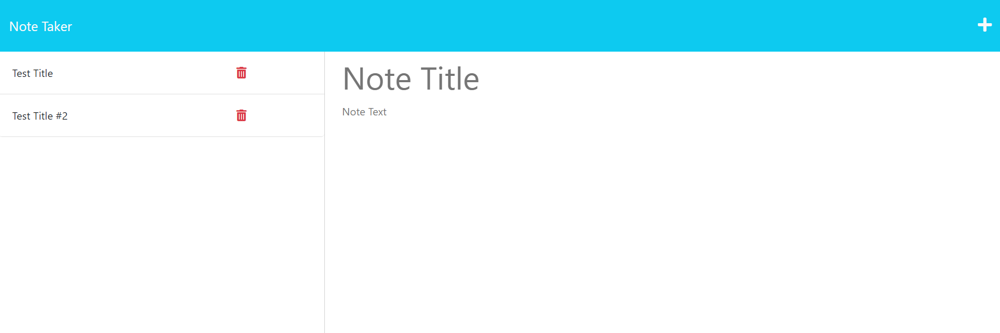

# take-a-note

[](https://opensource.org/licenses/MIT)

## Description

Note Taker is an application that allows you to create and save notes. This application uses an Express.js back end and saves and retrieves note data from a JSON file.

Heroku app: [Note Taker](https://arcane-coast-89065.herokuapp.com/)

## Table of Contents

- [Installation](#installation)
- [Usage](#usage)
- [License](#license)
- [Contributing](#contributing)
- [Tests](#tests)
- [Questions](#questions)

## Installation

To use this application, you will need to have Node.js installed on your computer. If you do not have it already, you can download it from the official website: https://nodejs.org/

Once you have installed Node.js, you can clone the repository or download the code as a ZIP file. Then, open a terminal or command prompt and navigate to the project directory.

1. Run the following command to install the required dependencies:

```
npm install fs express@4.16.4 uniqid@5.4.0
```

2. Start the application by running the following in the command line:

```
npm start
```

3. Open your browser and navigate to http://localhost:3001 to view the application.

## Usage

Visit the deployed site and click "Get Started". You can view saved notes on the left and create new notes on the right. To save a new note, enter a title and text, and click the save icon. To view a saved note, click on its title. To delete a note, click the trash can icon.



## License

This project is licensed under the [MIT](https://opensource.org/licenses/MIT) license. [](https://opensource.org/licenses/MIT)

## Contributing

If you find a bug or have a suggestion for how to improve Web-Agenda, please open an issue or submit a pull request on GitHub.

## Tests

To test please run

```
N/A
```

## Questions

For additional questions, please contact [mwstandish@aol.com](mailto:mwstandish@aol.com).

Follow me on GitHub at [MatthewStandish](https://github.com/MatthewStandish).
